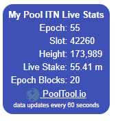

# pooltool.io
A public repo to keep track of issues and feature requests in pooltool

# Using ptwidget.html

To get a widget like this on your website, and insert the html into your website page.  Make sure you update the title of the table and your pool id first as well.  Note that the height reported is the PoolTool majority max height, not your own pool's height.  

Note the includes of Jquery and numeral.

If anyone would like to beautify the simple formatting or optimize this as a widget please let me know.  lifetime blocks will get added next time I'm updating the back end.

