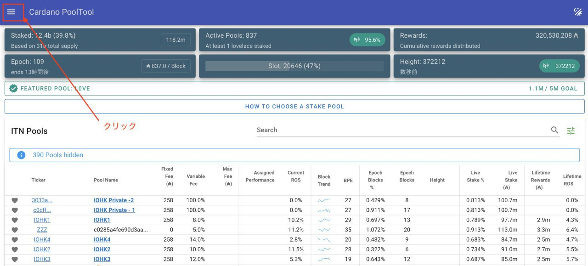
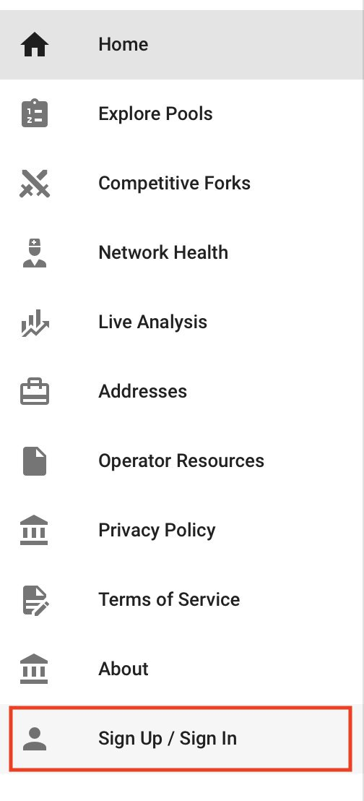
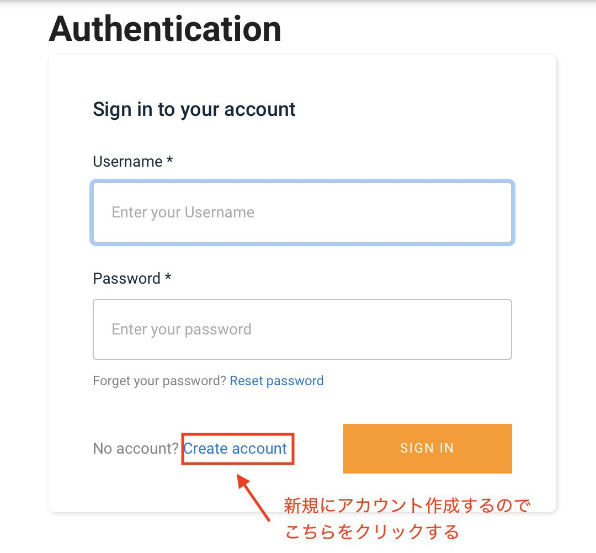
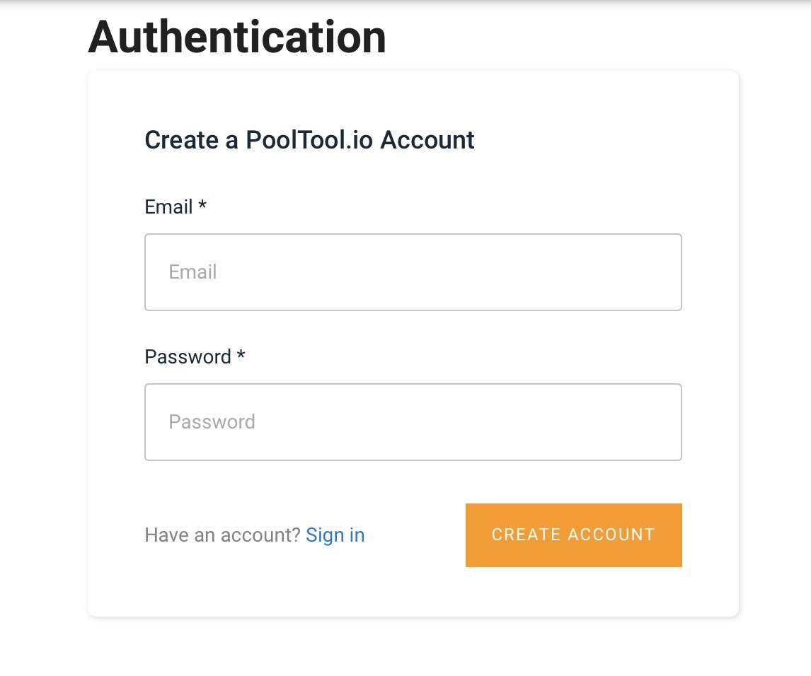
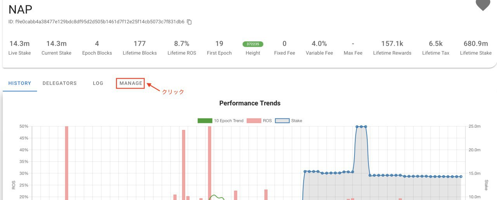
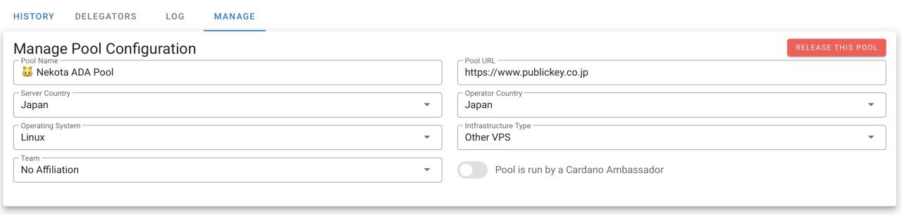

****Cardano PoolToolのアカウント登録方法****
（How to creat PoolTool account)

01

****Cardano PoolToolのメニューをクリックします。****

02

****Sign Up/ Sign Inをクリックします。****

03

****ログインの画面になりますが、新規にアカウントを作成するので、赤枠の[Create account]をクリックします。****

04

****Emailとパスワードを入力し[CREATE ACCOUT]をクリックします。****
（登録したEmailはログイン時のUsernameとなります。）

05

****[メニュー]の[Sign Up / Sign In]より登録した情報でログインします。ホーム画面が出ますので、プール名を入れて検索をします。検索結果で表示されたティッカーをクリックします。****

06

****表示された画面にある[MANAGE]タブをクリックします。****

07

****画面の項目を入力（または選択）して登録は終了となります。****
